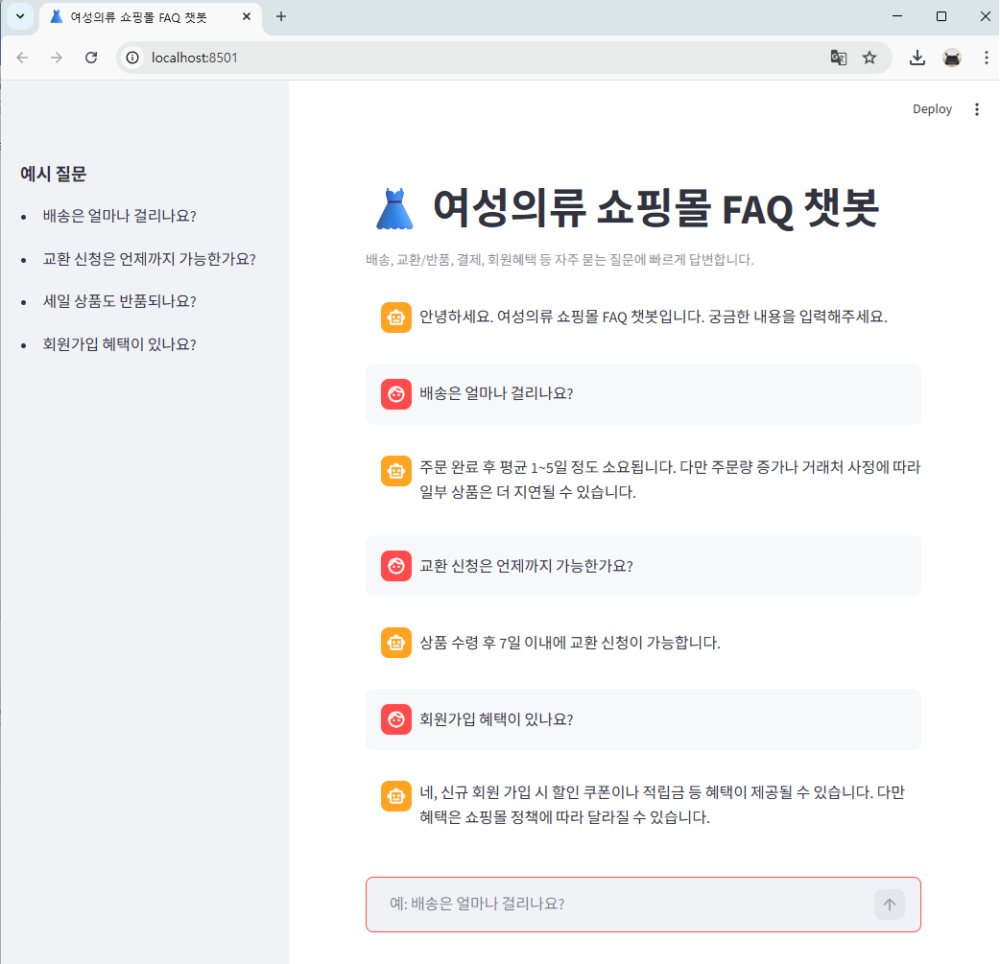

# 👗 여성의류 쇼핑몰 FAQ 챗봇

LangChain, OpenAI Embeddings, FAISS, Streamlit을 활용하여 구현한  
여성의류 쇼핑몰 FAQ 자동응답 챗봇 웹 애플리케이션입니다.

사용자가 질문을 입력하면 FAQ 데이터를 기반으로 의미적으로 가장 유사한 내용을 검색하고,  
자연스럽게 답변을 생성하는 벡터 검색 기반 챗봇(RAG 구조)입니다.

---


# 📌 프로젝트 소개

LangChain을 활용하여 챗봇의 설계·구현·배포 과정을 수행하여 여성의류 쇼핑몰에서 자주 발생하는 고객 문의를 자동으로 처리하기 위해 개발되었습니다.
웹 환경에서 사용자의 질문을 벡터로 변환하여 FAQ 데이터와 유사도를 비교한 뒤  가장 적절한 답변을 반환하는 **Semantic Search 챗봇** 입니다.

기존의 키워드 기반 FAQ 검색의 문제를 해결하기 위해  
의미 기반 검색(Semantic Search)을 적용했습니다.

---

# 🚀 2. 주요 기능

- FAQ 자동응답 챗봇
- 의미 기반 유사도 검색 (Vector Search)
- LangChain 체인 기반 응답 생성
- Streamlit 채팅형 UI
- JSON 기반 FAQ 데이터 관리

---

# 🧰 3. 기술 스택

- Python
- Streamlit
- LangChain
- OpenAI
- FAISS
- JSON

---

# 📂 프로젝트 구조

```
fashion-faq-chatbot/
├─ app.py
├─ vector_store.py
├─ faq_data.json
├─ requirements.txt
├─ README.md
├─ .gitignore
└─ images/
   └─ screenshot.png
```

---

# ⚙️ 5. 실행 방법

## 1. 저장소 클론
git clone https://github.com/geniusai2018/fashionmall-faq-chatbot
cd fashionmall-faq-chatbot

## 2. 가상환경 생성
python -m venv venv
venv\Scripts\activate

## 3. 패키지 설치
pip install -r requirements.txt

## 4. .env 설정
OPENAI_API_KEY=본인_API_KEY

## 5. 벡터 DB 생성
python vector_store.py

## 6. 실행
streamlit run app.py

---

# 💬 6. 예시 질문

- 배송은 얼마나 걸리나요?
- 교환 신청은 언제까지 가능한가요?
- 세일 상품도 반품되나요?
- 회원가입 혜택이 있나요?

---

# 🖥️ 7. 실행 화면



---

# 🧠 8. 구현 포인트

- 의미 기반 검색 적용
- 질문 + 답변 임베딩으로 정확도 향상
- LangChain 체인 활용
- 직관적인 채팅형 UI

---

# 📈 9. 기대 효과

- 고객 문의 자동화
- 응답 속도 향상
- 운영 비용 절감

---

# 👨‍💻 10. 프로젝트를 통해 배운 점

- 사용자의 표현이 달라도 의미를 이해하는 검색이 가능함을 통해 키워드 검색과 의미검색의 차이를 알았습니다.

- 벡터DB의 역할을 이해 할 수 있었다. 공간에서의 검색… 좀더 열심히 공부해 보겠습니다.

-  검색 + 생성이 결합된 구조인 RAG에 대한 이해하는 기회가 되었습니다.

- .env 사용하여 하드코딩을 제거하고 보안과 배포를 고려하는 개발방식

- UI/UX를 통해 사용자가 보기편한 인터페이스를 제공 


